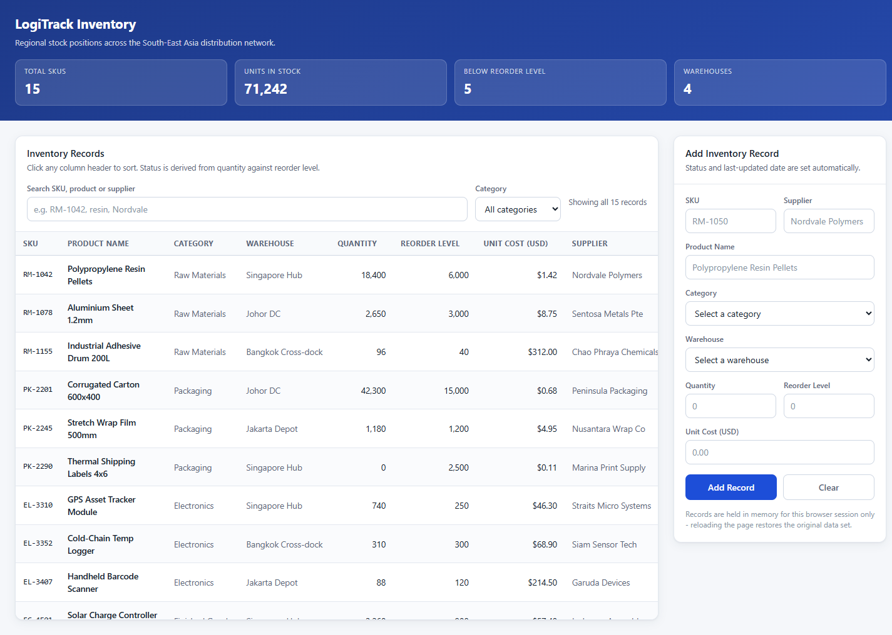

# Kacific Inventory Dashboard

A warehouse stock dashboard for tracking SKUs across a regional distribution network, styled in the
Kacific Broadband Satellites visual identity. It leads with four management KPIs — inventory value,
stock availability, lines needing action, and replenishment cost — over a searchable, sortable
inventory table, and closes with an on-page guide to using it. The entire application is a single
`index.html`: markup, CSS and JavaScript inline, no frameworks and no build step. Open the file and
it runs.



## Live demo

**https://chunkiat0989.github.io/Claude-Training/**

Deployed from `main` by GitHub Actions on every push.

## Running it locally

Clone the repo and open `index.html` in any modern browser. That is the whole setup — there is
nothing to install, compile, or serve.

```
git clone https://github.com/chunkiat0989/Claude-Training.git
cd Claude-Training
```

Then double-click `index.html`, or on Windows:

```powershell
Invoke-Item .\index.html
```

## The KPIs

The four tiles read the whole catalogue, not the filtered view, so the headline figures stay steady
while you search. Each is also defined on the page itself, in a "How each KPI is calculated" table.

| KPI | Definition | Why it matters |
| --- | --- | --- |
| **Inventory value** | Sum of quantity × unit cost across all lines | Working capital tied up in stock |
| **Stock availability** | Lines holding more than their reorder level, as a percentage of all lines | A service-level proxy — how much of the catalogue can be fulfilled without expediting |
| **Lines needing action** | Count of lines at or below reorder level, split into out of stock and low | The size of the purchasing workload today |
| **Replenishment cost** | Sum of (reorder level − quantity) × unit cost, over flagged lines only | The budget needed to clear the shortfall |

Two panels sit beneath them: a **stock status mix** bar showing the in-stock / low / out-of-stock
split, and **inventory value by warehouse** as ranked bars showing where the money is concentrated.

## Features

- **Management KPI strip** — the four figures above, plus the two breakdown panels, all recomputed
  on every change.
- **Search** across SKU, product name and supplier.
- **Category filter**, populated from a single source list so the options can never drift.
- **Typed column sorting** on all eleven data columns. Sorting is per-column-type rather than
  uniform: numeric for quantity, reorder level, unit cost and stock value; date order for
  last-updated; urgency order (Out → Low → In) for status; locale-aware text compare for the rest.
- **Derived stock status and stock value** — In Stock / Low / Out and quantity × cost are computed
  on every render. Neither is ever stored on a record, so neither can fall out of sync.
- **Add and delete records**, with newly added rows briefly highlighted.
- **On-page usage guide** — eight numbered steps at the bottom covering how to read the KPIs, find
  and sort lines, interpret the status pills, add and remove records, and what does not persist.
- **Accessible form validation** — hand-rolled, collecting every field error at once rather than
  stopping at the first, then focusing the earliest offending input. Errors are bound to their
  inputs via `aria-describedby` and `aria-invalid`; confirmations go to an `aria-live` region
  instead of `alert()`. Column headers expose `aria-sort`.

## Branding

The palette, typography and motifs follow the Kacific identity: `#034EA2` brand blue for headings,
the app bar and primary controls; Montserrat named in the font stack; the house pill button shape;
the two stacked blue footer bands; and the orbit-ellipse motif used once, as faint cyan hairlines
behind the header. The logo is embedded as a base64 `data:` URI so the page still fetches nothing.

Montserrat is *named* but never downloaded — loading a web font would break the no-network
constraint below — so it renders where the viewer already has it installed and falls back to the
system sans stack otherwise.

Status colours (green / amber / red) are kept deliberately separate from the brand blue and are
validated for colour-vision-deficiency separation. Nothing on the page is conveyed by colour alone:
every status carries a text label, and every chart segment carries either a direct label or a
legend entry.

## Design constraints

These were deliberate and are worth preserving if you fork it:

- **One file.** No frameworks, no bundler, no external libraries, no CDN links, no web fonts. The
  page makes no network requests of any kind.
- **No storage APIs.** State lives in memory only — reloading the page deliberately restores the
  seed data. There is no `localStorage`, no backend, and nothing persists.
- **One-way data flow.** A single `inventory` array is the source of truth and the DOM is a pure
  projection of it; no code reads state back out of the markup. Every mutation re-renders.
- **No inline event attributes.** Everything is wired through `addEventListener`.
- Cells are built with `textContent`, never `innerHTML`.

## Data note

The inventory rows are **sample data — invented for this demo**. The SKUs, quantities, costs,
supplier names and warehouse locations do not correspond to real stock, real vendors, or any real
Kacific system, and the figures shown are not real stock positions.

## Repository contents

| Path | What it is |
| --- | --- |
| `index.html` | The entire application. |
| `CLAUDE.md` | Architecture notes and invariants, for working on the code with Claude Code. |
| `.claude/commands/` | A reusable slash command for publishing this project to GitHub. |
| `.claude/skills/` | The Kacific branding skill — palette, type scale, logo assets and usage rules. |
| `docs/screenshot.png` | The README screenshot. Not used by the application. |

## Status

No tests, no CI beyond the Pages deploy, and no license file — this is a demo project. If you want a
license added, say so and one can be included.
